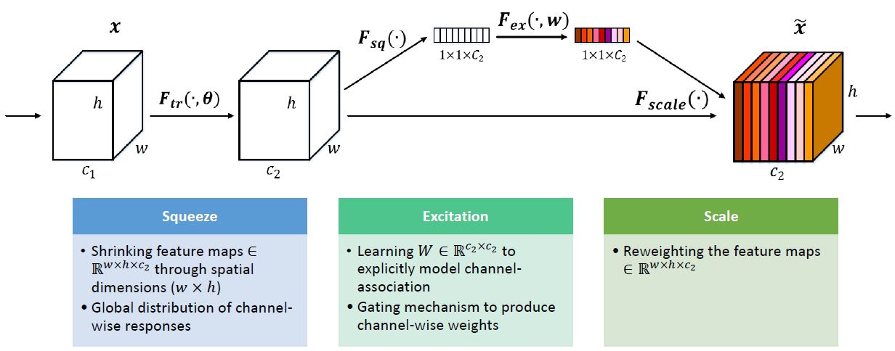
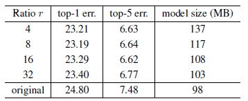
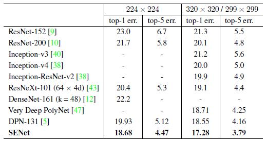

# SENet-Tensorflow
Simple Tensorflow implementation of [Squeeze Excitation Networks](https://arxiv.org/abs/1709.01507) using **Cifar10** 

* [论文解读](https://github.com/jiye-ML/tensorflow-classification-network/18.Squeeze-and-Excitation%20Networks.md)

I implemented the following SENet
* [ResNeXt paper](https://arxiv.org/abs/1611.05431)
* [Inception-v4, Inception-resnet-v2 paper](https://arxiv.org/abs/1602.07261)

If you want to see the ***original author's code***, please refer to this [link](https://github.com/hujie-frank/SENet)


## Requirements
* Tensorflow 1.x
* Python 3.x
* tflearn (If you are easy to use ***global average pooling***, you should install ***tflearn***)

## Issue
### Image_size
* In paper, experimented with *ImageNet*
* However, due to **image size** issues in ***Inception network***, so I used ***zero padding*** for the Cifar10
```python
input_x = tf.pad(input_x, [[0, 0], [32, 32], [32, 32], [0, 0]]) # size 32x32 -> 96x96
```
### NOT ENOUGH GPU Memory
* If not enough GPU memory, Please edit the code
```python
with tf.Session() as sess : NO
with tf.Session(config=tf.ConfigProto(allow_soft_placement=True)) as sess : OK
```

## Idea
### What is the "SE block" ?

```python
def Squeeze_excitation_layer(self, input_x, out_dim, ratio, layer_name):
    with tf.name_scope(layer_name) :
        squeeze = Global_Average_Pooling(input_x)

        excitation = Fully_connected(squeeze, units=out_dim / ratio, layer_name=layer_name+'_fully_connected1')
        excitation = Relu(excitation)
        excitation = Fully_connected(excitation, units=out_dim, layer_name=layer_name+'_fully_connected2')
        excitation = Sigmoid(excitation)

        excitation = tf.reshape(excitation, [-1,1,1,out_dim])

        scale = input_x * excitation

        return scale
```

### How apply ? (Inception, Residual)
<div align="center">
   
  
</div>

### How *"Reduction ratio"* should I set?

* **original** refers to ***ResNet-50***

## ImageNet Results
### Benefits against Network Depth


### Incorporation with Modern Architecture


### Comparison with State-of-the-art


## Cifar10 Results
Will be soon

## Related works
* [Densenet-Tensorflow](https://github.com/taki0112/Densenet-Tensorflow)
* [ResNeXt-Tensorflow](https://github.com/taki0112/ResNeXt-Tensorflow)
* [ResNet-Tensorflow](https://github.com/taki0112/ResNet-Tensorflow)

## Reference
* [Inception_korean](https://norman3.github.io/papers/docs/google_inception.html)

## Author
Junho Kim
